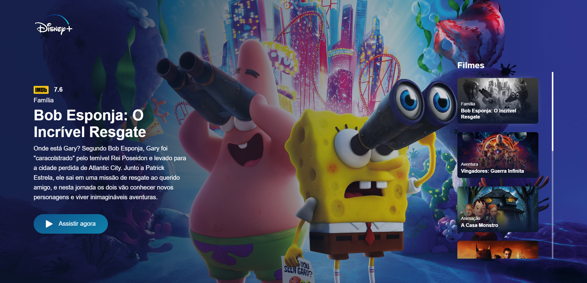
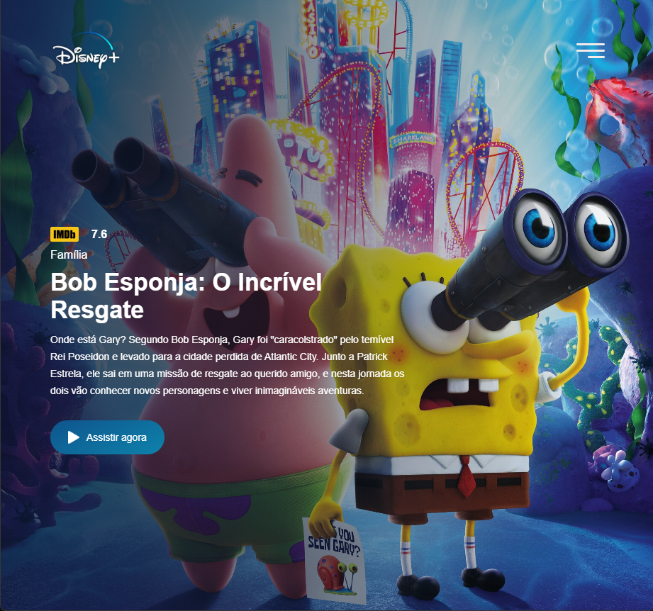
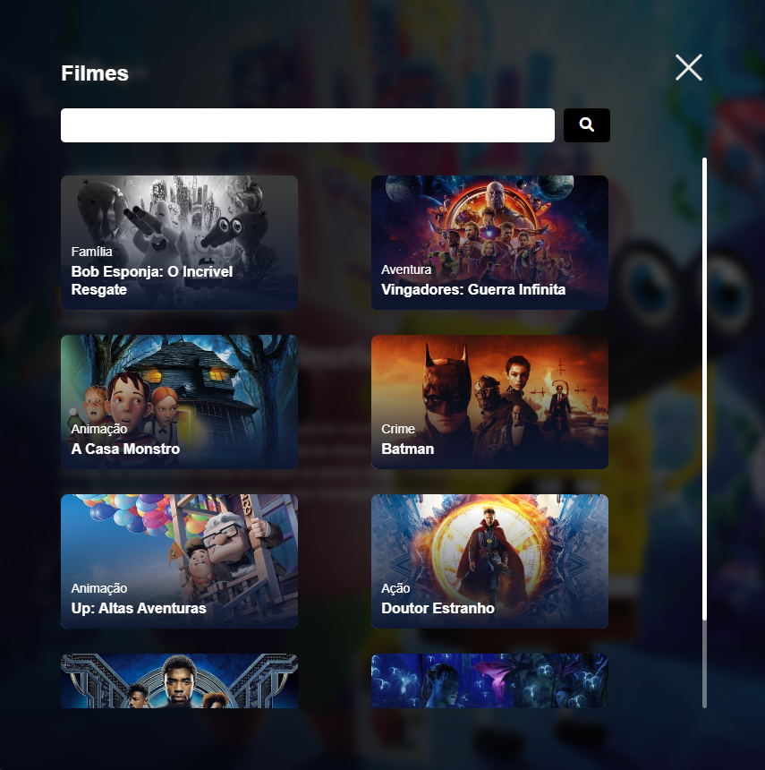

<h1 align="center">
  Clone interface Disney+
</h1>

  

## 🚀 Tecnologias

- HTML
- CSS
- JavaScript
- [API TMDB](https://www.themoviedb.org/documentation/api)

## 💻 Descrição

Projeto Clone da interface Disney plus, feito com html, css e javascript. Dados dos filmes, como titulo, descrição, avaliação, gênero e etc, são fornecidos atraves da API [TMDB](https://www.themoviedb.org/documentation/api). [link de acesso](https://www.figma.com/file/AfcZjKNRxDWOSSI0vrnrls?node-id=0%3A105) ao protótipo do figma utilizado como base. O projeto contém algumas alterações feitas por mim, como por exemplo, o menu responsivo na resolução 1280p com uma barra de pesquisa na lista de filmes e algumas outras modificações no css.

## ➜ @media em 1280p e Barra de Pesquisa:

  

  

